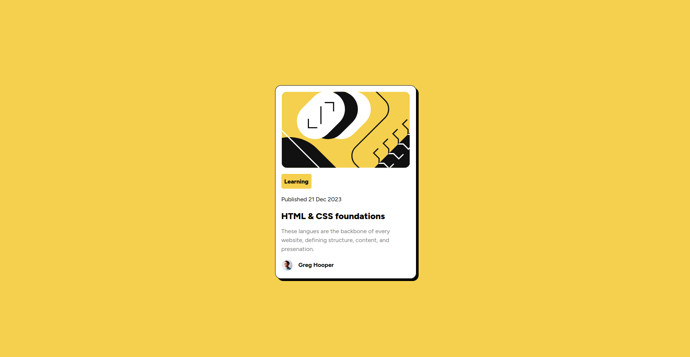

# Frontend Mentor - Blog preview card solution

This is a solution to the [Blog preview card challenge on Frontend Mentor](https://www.frontendmentor.io/challenges/blog-preview-card-ckPaj01IcS) 

### Screenshot

### Links
Live site: [Here](https://blog-preview-albrrak77.netlify.app/)

### Buildt with
* basic HTML & CSS
* used flexbox for the layout

### What I learned
Not much, This is a pertty simple design
### Useful resources
* I used [This Article](https://css-tricks.com/almanac/properties/b/box-shadow/) from css-tricks to know how to use box-shadow
* [The Frontedn Mentor Challenges Page](https://www.frontendmentor.io/challenges/blog-preview-card-ckPaj01IcS) - This the website I got this challenge from
